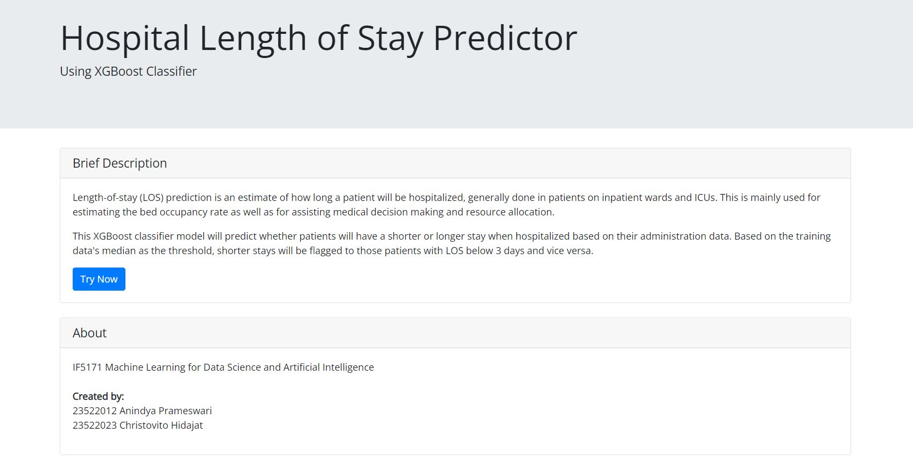
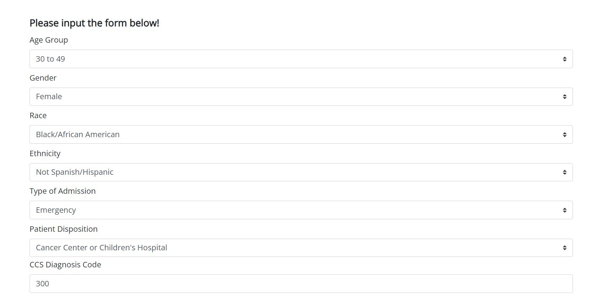
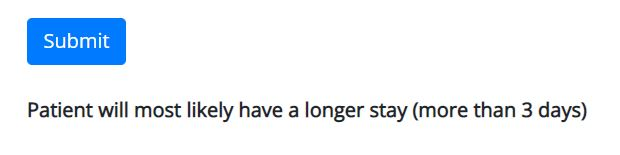

# los-predictor

## **IF5171 Machine Learning for Data Science and Artificial Intelligence** ##

### **Created by:** ###
23522012 Anindya Prameswari <br>
23522023 Christovito Hidajat

### **Description** ###
Length-of-stay (LOS) prediction is an estimate of how long a patient will be hospitalized, generally done in patients on inpatient wards and ICUs. This is mainly used for estimating the bed occupancy rate as well as for assisting medical decision making and resource allocation.<br>
<br>
This XGBoost classifier model will predict whether patients will have a shorter or longer stay when hospitalized based on their administration data. Based on the training data's median as the threshold, shorter stays will be flagged to those patients with LOS below 3 days and vice versa.

### **How to Run** ###
1. You need to download all the folders and files with the exact same directories.
2. Since Github limits the file size up to 25 MB, you can replace the full training data in `data` directory with [this file](https://drive.google.com/file/d/1koU_GSKNj2K39_RdrMqHVXt2riMB15DE/view?usp=sharing).
3. In your directory command prompt, simply run ```model.py``` to create the model for the first time. Onwards, after the model is stored, you can directly run ```app.py```. Note that you must have several libraries installed in a Python environment.
4. Head over to your browser and open `http://127.0.0.1:5000/` (please adjust with your default local address and port).

##### **Home Display** #####

To continue, click the **Try Now** button.

##### **Form Display** #####

Fill all the fields, then click Submit.

##### **Prediction Result** #####
<br>
After submitting the form, you will see the prediction result under the Submit button. It says the patient will have either a longer or longer stays.
